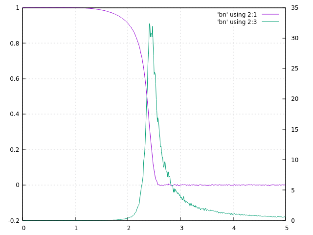
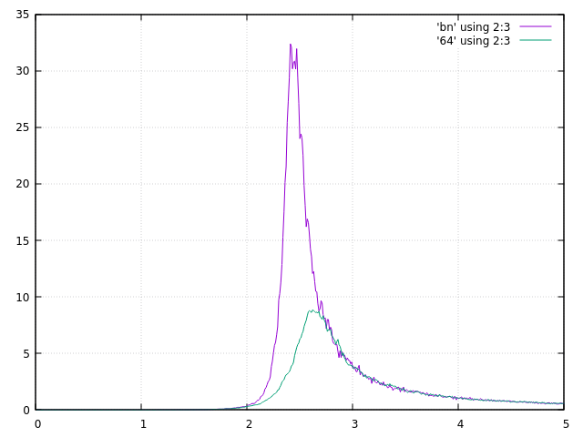
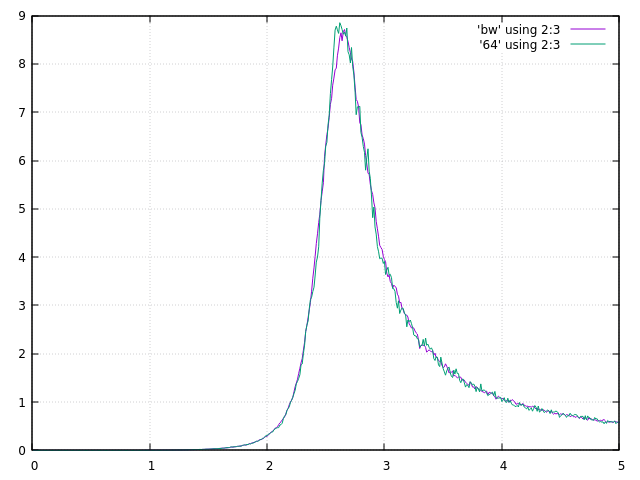
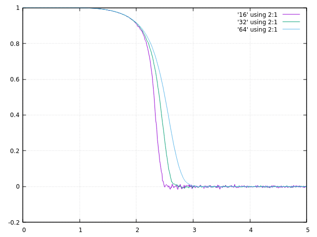
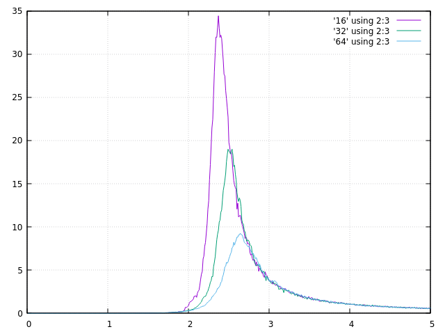
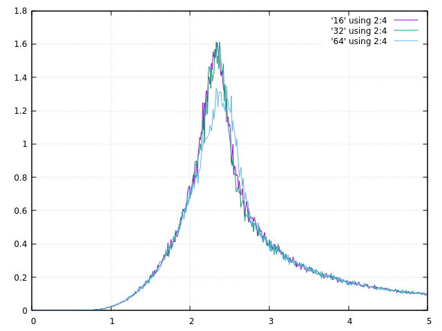
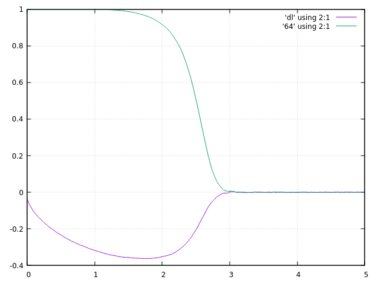

# Data Explained

## how to get these files?

1. Grab the output of `./Ising`

2. run commands in [gnuplot Hint](gnuplot_hint.txt)

3. run [gnuplot Code](gp/gp_code)

* * *

## Overview

## Critical Temperature

Setting n to a larger number, Tc = 2.45.

Setting n to a larger number, didn't improve much.

I'll just believe 2.45.

## 16 32 64

M grows with lattice size...

Chi grows with lattice size...

While Cv doesn't, it shows us the cluster effect.

*The system tends to form into large clusters of predominantly up- or down-pointing spins as it approaches the critical temperature from above. These clusters contribute significantly to both the magnetization and the energy of the system, so that, as they flip from one orientation to another, they produce large fluctuations in m and E, often called critical fluctuations.*

## Ordered and Disordered initials

The convergence of disordered-near-zero is way worse than
convergence of ordered-far-zero, and both are bad practices.

Good practices are initiate randomly at hight-T, and initiate all with the same spin at low-T.

* * *

"disorder_low_t.txt" has a smaller time elapsed,
because I have "-O3" the compiling.*
